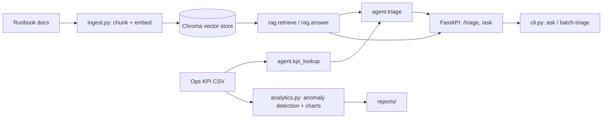

# NetOps GenAI Assistant

An agentic RAG assistant for network-operations incident triage. Given a free-text
incident description, it retrieves relevant runbook documentation, pulls the affected
site's live KPI metrics through a tool call, and returns a structured triage decision
(severity, likely cause, recommended steps, cited sources). A separate analytics module
profiles the operational KPI data for anomalies. An evaluation harness (six models,
four test suites, LLM-judge and deterministic metrics) probes both the RAG answers and
the triage decisions against labeled data, including two ablation designs built to
stress-test whether retrieval is actually doing anything.

## Key findings

**Across the full evaluation suite (4 test designs × 6 local LLMs, 96 total
model/scenario runs), retrieval lifts answer correctness by an average of +18.3
percentage points, with perfect (1.00) retrieval accuracy in every single run.**

That average is driven by exactly the scenario RAG is supposed to win: on facts a
model cannot possibly know without retrieval, grounding takes correctness from ~60%
to 100% across all six models tested, every time. It's not a story of universal,
model-agnostic lift, though: performance is model-dependent (that's the point of
testing six of them). The full model-by-model, scenario-by-scenario breakdown,
including where RAG's edge shrinks or disappears, is in **[REPORT.md](REPORT.md)**.

- **Retrieval is solved for this corpus**: hit_rate@k = 1.00 in every run, across all
  six models tested. Whatever else varies, the system never fetches the wrong document.
- **Grounding is decisive exactly where it should be**: +39.6pp correctness on facts
  fabricated to be unknowable without retrieval, 6 of 6 models.
- **Model choice determines whether retrieved context actually gets trusted.** Given a
  runbook fact that contradicts generic troubleshooting wisdom, 4 of 6 models correctly
  override their own prior; 2 of 6 mostly refuse to answer at all.
- **Bigger and reasoning-tuned models don't reliably improve triage accuracy**:
  `deepseek-r1:14b`'s extended reasoning traces don't beat smaller non-reasoning models
  on cause/severity accuracy, and take much longer to produce an answer.
- Six local backends compared under one fixed, seeded, checkpointed evaluation
  pipeline. See [REPORT.md](REPORT.md#bugs-found-and-fixed-along-the-way) for the full
  bug-fixing story (chunking, stale indexes, model-swap thrashing) behind getting these
  numbers to be trustworthy.

## Architecture



## Stack

- **Language / runtime**: Python 3.11
- **Retrieval**: Chroma, sentence-transformers (`all-MiniLM-L6-v2`)
- **Serving**: FastAPI, pydantic
- **Analytics**: pandas, matplotlib, scikit-learn
- **LLM client**: `src/llm.py` hits Ollama's OpenAI-compatible `/v1/chat/completions`
  endpoint directly over HTTP, no vendor-specific SDK. Swapping in any other
  OpenAI-compatible backend (vLLM, LM Studio, a hosted API, a different machine on the
  network) is a base-URL and model-name change (`OLLAMA_HOST`, `LLM_MODEL` env vars),
  no code changes. A fixed seed (`LLM_SEED`) is sent on every call for reproducibility.
- **Evaluation**: direct LLM-as-judge prompting (`ragas` was tried first but its pinned
  version fails to import against the installed `langchain-community`) plus
  deterministic ROUGE-L/BLEU. See `src/evaluate.py`.

## Setup

```
python3.11 -m venv .venv && source .venv/bin/activate
pip install -r requirements.txt
ollama pull llama3.1:8b
python -m src.ingest          # build the vector index
```

## Usage

```
python -m src.cli ask "What should I check for high latency on a cell site?"
python -m src.agent "site 12 has high latency and packet loss"
python -m src.cli batch-triage incidents.txt results.csv
uvicorn src.app:app --reload
```

```
curl -X POST http://127.0.0.1:8000/triage \
  -H "Content-Type: application/json" \
  -d '{"incident": "site 05 has high packet loss"}'
```
```json
{
  "severity": "medium",
  "likely_cause": "physical layer errors (cable/connector degradation), interface buffer overflow during traffic bursts, or a faulty SFP/transceiver",
  "recommended_steps": [
    "Check PRB utilization at failure times",
    "Check uplink interference (noise floor) trend",
    "If a recent software change coincides with the onset, consider rollback",
    "Check interface error counters (CRC errors, input/output drops)"
  ],
  "sources": ["RB002_packet_loss", "RB014_signaling", "RB017_vpn"],
  "latency_ms": 14797.5
}
```

## Evaluation

```
python -m src.evaluate                        # main eval, default model
python scripts/run_ablation.py                # RAG vs. zero-shot, main qa_set
python scripts/run_invented_facts_ablation.py # RAG vs. zero-shot, unknowable facts
python scripts/run_counterfactual_ablation.py # RAG vs. zero-shot, context-overrides-prior
```

Each script targets one model (edit the `MODEL` constant, or pass `model=` if calling
the functions directly) and writes results to `eval/`. See
[REPORT.md](REPORT.md#results) for the full six-model, four-suite comparison and what
it means.

## Analytics

`python -m src.analytics` profiles `data/ops_kpis.csv`, flags per-site anomalies via a
z-score threshold on latency/throughput/packet-loss, and writes charts plus an insights
summary to `reports/`.

## Tests

```
pytest -m "not llm"   # fast, no LLM required (this is what CI runs)
pytest                # full suite, requires a running Ollama instance
```

## Contact

Please feel free to reach out to me at aaron@bateni.org.
