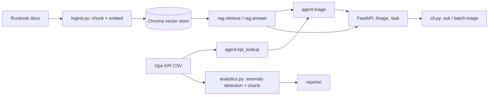

# NetOps GenAI Assistant

An agentic RAG assistant for network-operations incident triage. Given a free-text
incident description, it retrieves relevant runbook documentation, pulls the affected
site's live KPI metrics through a tool call, and returns a structured triage decision
(severity, likely cause, recommended steps, cited sources). A separate analytics module
profiles the operational KPI data for anomalies. An evaluation harness scores both the
RAG answers and the triage decisions against labeled data.

## Architecture



## Stack
Python 3.11, sentence-transformers (all-MiniLM-L6-v2), Chroma, Ollama (llama3.1:8b,
local inference), FastAPI, pandas, matplotlib, scikit-learn, pydantic. Evaluation uses
a direct LLM-as-judge (ragas 0.2.10 was attempted but has a broken import against the
installed langchain-community version, so a lightweight judge prompt is used instead —
see `src/evaluate.py`).

## Setup
```
python3.11 -m venv .venv && source .venv/bin/activate
pip install -r requirements.txt
ollama pull llama3.1:8b
python -m src.ingest          # build the vector index
```

## Usage
```
python -m src.cli ask "What should I check for high latency on a cell site?"
python -m src.agent "site 12 has high latency and packet loss"
python -m src.cli batch-triage incidents.txt results.csv
uvicorn src.app:app --reload
```

```
curl -X POST http://127.0.0.1:8000/triage \
  -H "Content-Type: application/json" \
  -d '{"incident": "site 05 has high packet loss"}'
```
```json
{
  "severity": "medium",
  "likely_cause": "physical layer errors (cable/connector degradation), interface buffer overflow during traffic bursts, or a faulty SFP/transceiver",
  "recommended_steps": [
    "Check PRB utilization at failure times",
    "Check uplink interference (noise floor) trend",
    "If a recent software change coincides with the onset, consider rollback",
    "Check interface error counters (CRC errors, input/output drops)"
  ],
  "sources": ["RB002_packet_loss", "RB014_signaling", "RB017_vpn"],
  "latency_ms": 14797.5
}
```

## Evaluation

Run `python -m src.evaluate` for a fresh run. Measured on 30 grounded Q/A pairs and
15 labeled incidents:

| Metric | Value |
|---|---|
| RAG hit-rate@k | 1.00 |
| RAG avg. faithfulness (1-5) | 4.73 |
| RAG avg. relevance (1-5) | 4.93 |
| Triage severity accuracy | 0.60 |
| Triage cause accuracy | 0.47 |

Triage accuracy is meaningfully lower than the RAG metrics — see REPORT.md for why and
what would improve it.

## Analytics

`python -m src.analytics` profiles `data/ops_kpis.csv`, flags per-site anomalies via a
z-score threshold on latency/throughput/packet-loss, and writes charts plus an insights
summary to `reports/`.

## Tests
```
pytest -m "not llm"   # fast, no LLM required
pytest                # full suite, requires a running Ollama instance
```
